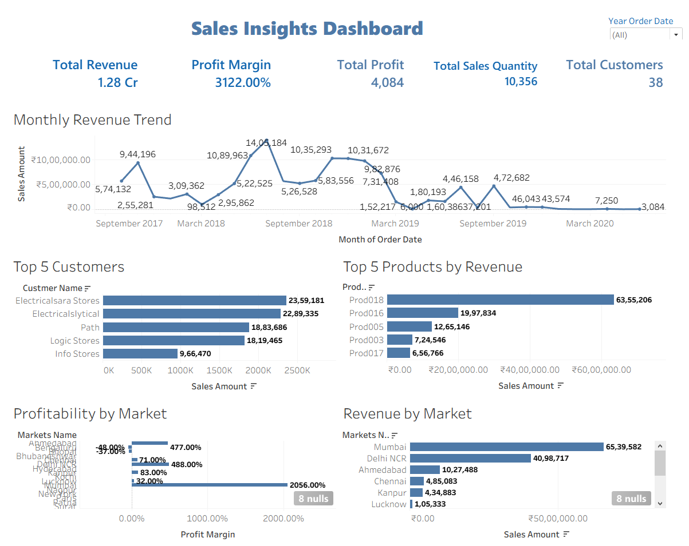

# Sales-Insights-Tableau-Dashboard
Sales Insights Dashboard built using Tableau 

## 📌 Project Overview
This project analyzes retail sales performance using Tableau to provide business insights for strategic decision-making.
The dashboard provides revenue trends, profitability analysis, customer insights, and market performance tracking.

---

## 📊 Dashboard Features
### KPI Cards
- Total Revenue (Cr)
- Total Profit (Cr)
- Profit Margin (%)
- Sales Quantity
- Total Customers

### Visualizations
- Monthly Revenue Trend
- Revenue by Market
- Top 5 Customers by Revenue
- Top 5 Products by Revenue
- Profitability by Market
---

## 🛠 Tools Used
- Tableau
- Excel
- Data Modeling
- Calculated Fields
- Interactive Filters
---

## 📷 Dashboard Preview

---

## 🚀 Key Insights
- Identified loss-making markets
- Observed seasonal revenue patterns
- Highlighted top-performing customers
- Supported strategic pricing decisions
